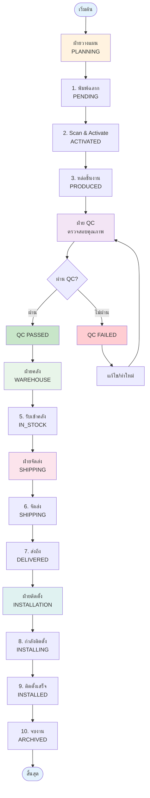
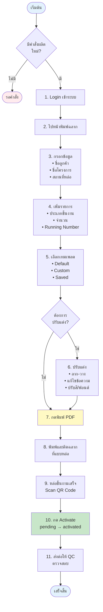
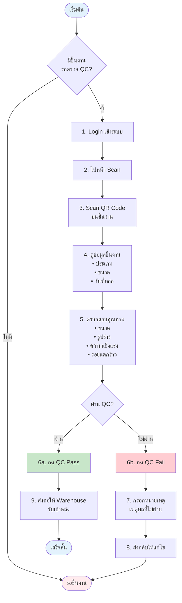

# ตัวอย่าง Mermaid Diagrams สำหรับ USER_MANUAL.md

## 1. Main Workflow Diagram

## 2. Planning Flow

## 3. QC Flow

## วิธีใช้:

1. คัดลอก Mermaid code ด้านบน
2. แทนที่ ASCII art diagrams ใน USER_MANUAL.md
3. Export PDF ใหม่

Mermaid จะถูกแปลงเป็น SVG อัตโนมัติและแสดงผลสวยงามใน PDF!
